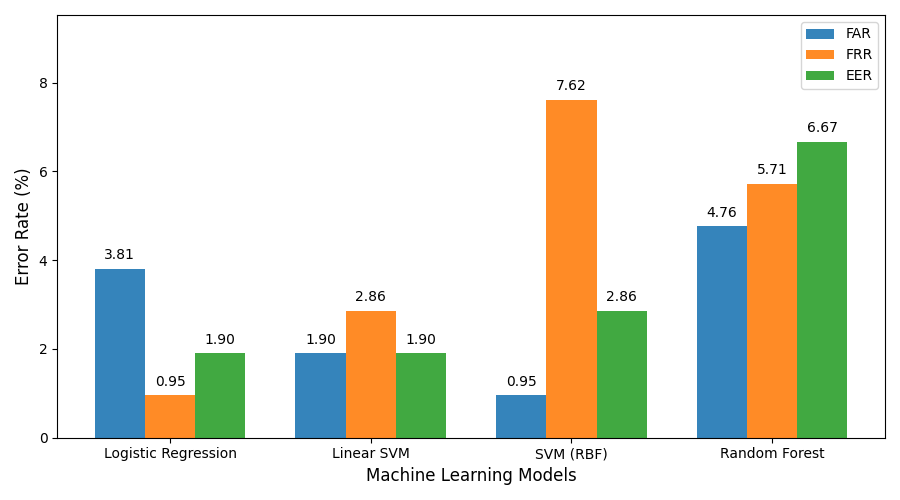

# Eye Tracking Authentication

This repository contains work from my thesis titled  
**“Study and Development of a Secure Authentication System Using Eye Tracking.”**

## Overview

This thesis investigates the use of **eye movements and physiological eye features** as an additional security layer for authentication systems.

Traditional authentication methods such as passwords and PINs are widely used but remain vulnerable to attacks and credential compromise. Biometric authentication methods offer improved security, as biometric traits are generally more difficult to steal or spoof. Eye movements represent a form of **behavioral biometrics** and are closely linked to perception and cognition, making them difficult to consciously control or imitate.

The core hypothesis of this research is that **genuine users** entering their credentials exhibit eye movement patterns that differ from those of **impostors**, even when both use the same valid credentials.

---

## Methodology

To evaluate this hypothesis, eye-tracking data were collected during password entry tasks from both genuine users and impostors. From these recordings, a dataset of **eye movement features and physiological eye characteristics** was constructed.

This dataset was used to train and evaluate four machine learning classifiers:

- Logistic Regression
- Linear Support Vector Machine (Linear SVM)
- Support Vector Machine with RBF kernel (RBF SVM)
- Random Forest

---

## Experimental Setup and Results

Two experimental approaches were examined:

### Experiment 1 – Full Training Set
- **70% of the dataset** used for training
- All evaluated models achieved **perfect performance**
- **Equal Error Rate (EER): 0.00%**

### Experiment 2 – Limited Training Set
- **11.76% of the dataset** used for training
- Models maintained strong performance
- Best observed **EER: 1.90%**

---

## Conclusions

The results demonstrate that eye movement features captured during password entry contain **discriminative information** capable of distinguishing genuine users from impostors. These findings support the feasibility of **eye tracking as a complementary authentication factor** to enhance the security of traditional password-based systems.

This work provides a foundation for further research into the use of behavioral biometrics in secure authentication systems.

---

## Data Availability

⚠️ **Note:**  
The eye-tracking dataset used in this study is **not included in this repository** due to privacy and ethical constraints.

---

## License

This project is provided for academic and research purposes.
